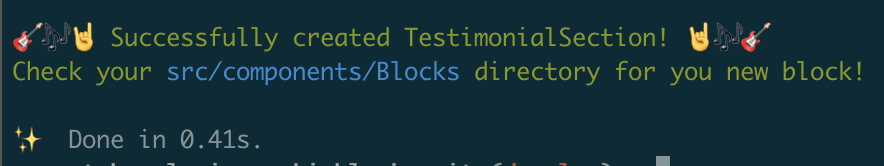

# Rockin' Blocks

## Why Rockin' Blocks?

<a href="#why-rockinblocks"></a>

**Create, publish, and maintain your own re-usable block library and use it in a GatsbyJS page builder. Build your app right on top of your documentation. Maintain brand consistency across all your web touchpoints.**

**Rockin' Blocks** is an open-source Gatsby workspace with design-focused, documentation-driven development in mind. **Rockin' Blocks** was created to provide a free foundation to better equip tech startups for success, or really any company in general that is ready to level-up their frontend applications.

- **Design should never be an afterthought.** Companies can struggle when design takes _too much_ of a back seat to solving business and technical problems. **Rockin' Blocks** is created for companies that are looking to start things off on the right foot, or maybe even companies that are looking to turn over a new leaf and start fresh.
- **Components should be shareable across all of your web touchpoints.** If your company has five different apps, and they are all under the same brand umbrella, you should be developing and maintaining the same component library across all five applications.
- **Frontend developers should be able to work independently of their backend counterparts.** Leveraging Storybook enables your frontend team to work in isolation and make progress on the design front without waiting for APIs to be completed by your backend team.
- **Agencies and freelancers should be able to easily provide their clients with a real design solution.** **Rockin' Blocks** by design provides a true design system for your clientele, not just a CMS theme with style overrides. Over time, their system grows, along with their block library, as company needs become more clear. 


## Get Started

<a href="#get-started"></a>

### Dependencies

#### Node 15

**Rockin' Blocks** requires Node 15 to support the M1 chip in my new Mac. I know this might be a pain, so I do recommend installing `brew` and subsequently `nvm` to switch to Node 15.

#### Yarn

Yarn is currently required in order to use **Rockin' Blocks**, which leverages Yarn workspaces to create an easy-to-use environment that houses all of your Javascript applications in one place.

[Lerna support is potentially on the horizon](https://github.com/rockinblocks/rockinblocks/issues/27), though at this time the primary focus is support for Yarn workspaces.

### Using the monorepo

To get the most out of **Rockin' Blocks**, you should clone down the monorepo, which is a [Yarn workspace](https://classic.yarnpkg.com/en/docs/workspaces/) where you can develop your block library, your documentation, and your Gatsby project together in the same spot. If you haven't used a Yarn workspace before, no worries: **Rockin' Blocks** should work right away without any configuration.

```
# Clone down the Yarn workspace a new project folder
# We will call our app rb-demo-app

$ git clone https://github.com/rockinblocks/rockinblocks.git rb-demo-app

# Change into your new project directory
# Unhook from our Git remote, and initialize your own Git

$ cd rb-demo-app && rm -rf ./.git && git init

```

#### Install everything with Yarn

Because we are leveraging Yarn workspaces, **Rockin' Blocks** does require you to use Yarn as your package manager, at least for now.

```
# Install your dependencies with Yarn
# This will install your dependencies for each package in the workspace

$ yarn install
```

This will install all dependencies throughout the workspace to Gatsby, your block library, and our CLI tool, `riff`, as well.

## Development

#### Generate a block with Riff 🎸

**Rockin' Blocks** comes with `riff`, an early version of our CLI tool, to quickly generate a block. As of right now, `riff` needs to be run from within the `gatsby-plugin-rockinblocks` directory 

```
# From within gatsby-plugin-rockinblocks
yarn riff --name=TestimonialSection
```

You should see the following success message (as of version 0.1.0):



#### Developing your blocks in isolation within Storybook

**Unlike Riff, which should be run from within the blocks plugin, these commands should be run from within `gatsby-plugin-rockinblocks`**

**These commands should be run from the root of your workspace, not within the individual packages.** While you can run commands from within each package, it does get a little cumbersome bouncing from folder to folder, so we have provided some helper commands that can be run from the root of your workspace.

```
# Develop your blocks in Storybook
# This should open Storybook on http://localhost:6006

$ yarn blocks:sb
```
#### Building a new version of your blocks package

Because we are leveraging Yarn workspaces, each time you build your **Rockin' Blocks** library, your Gatsby installation will automatically see the newest version of your blocks package, without going through the trouble of having to cut a new release.

```
# Build your blocks library
# The changes will automatically get picked up in your Gatsby site

$ yarn blocks:build
```

#### Seeing your blocks in your Gatsby site

While building out a block, Storybook is typically the fastest way to work, but sometimes you want to be sure that Gatsby is properly pulling in your blocks package and everything looks okay. This is achieved by starting your Gatsby development server, and then building your blocks library. **Please note that changes made while developing in Storybook will not be seen in your Gatsby application until you build your blocks library.** This is because the `dist`, which is created during the build, is what is distributed within the NPM package, and subsequently to your Gatsby site.

```
# Start your Gatsby development site
# This should spin up on port http://localhost:8787

$ yarn web:dev

# Build your blocks library
# The changes will automatically get picked up in your Gatsby site

$ yarn blocks:build
```

